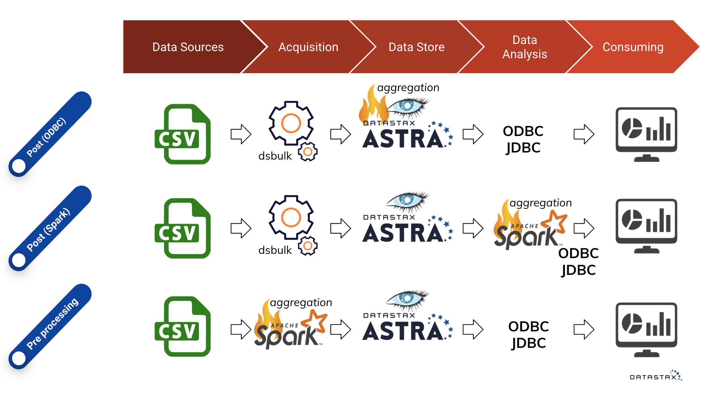
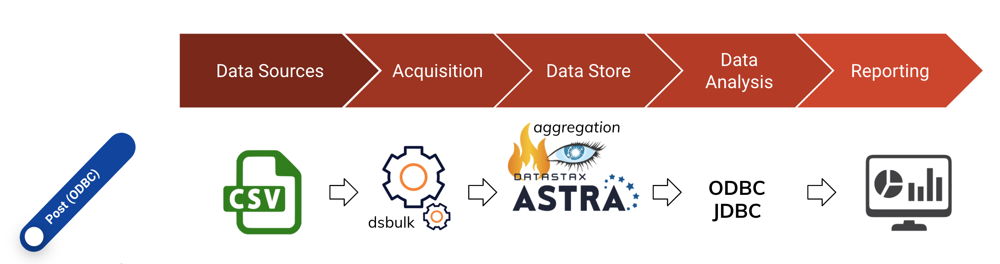
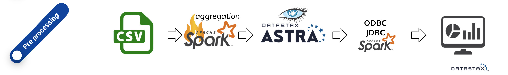

# CSV analytics with Cassandra

# Use case
The original file has a size of 2GB and contains around 400 million rows. Once the file is downloaded, we need to process it as described below:
 
- Drop the columns hotel_id, hotel_name, hotel_type, classification, city, lat, lon, url, month_cohort, active_property and active_rooms;
- Group all rows by the columns source, month, region, country and brand;
- Aggregate the values of the columns reservations and room_nights (And add the result of this sum to the grouped by rows).  
 
Once the processing of the data is finished, we end up with ~200000 rows.

# Solution
The solution makes use of either Astra (http://astra.datastax.com) or DSE (DataStax Enterprise).  
There are different paths to a solution here and we're going to investigate three options.



## Post processing
Astra is used to implement a post processing solution where the aggregation work is done at query-time on the Cassandra database.  
DSE is also used in a post processing scenarion, except now the aggregation work is done on a Spark layer.
## Pre processing
In the case of pre processing, DSE is used and the aggregation is done in Spark prior to loading the results in the database.

# Preparations
We're going to prepare the following:
- Provisioning an Astra database;
- Provisioning a DSE Docker Container;
- Installation of dsbulk, a bulk tool loader for Cassandra;
- Download the ODBC/JDBC and Spark drivers.  

## Provisioning Astra
Browse to https://astra.datastax.com and sign up for a free database-as-a-service tier.  
Create a database, providing a keyspace name (testdb) and a username, password.  
Done, you have Cassandra running in the cloud.

## Provisioning a DSE Docker Container
Make sure you have Docker (https://docker.com) installed.
 
Start DSE with Spark enabled and open up port 10000 for JDBC.  
Other available port mappings:
```
-p 4040:4040    # (UI for Spark application / ThriftServer)
-p 4041:4041    # (UI for Spark application / Spark shell)
-p 7077:7077    # Spark Master
-p 7080:7080    # Spark Master UI
-p 9091:9091    # DSE Studio
-p 9077:9077    # Always On SQL UI
-p 8888:8888    # OPS Center
-p 9042:9042    # Native clients port
-p 10000:10000  # Spark SQL
```
```sh
docker run \
    -e DS_LICENSE=accept \
    -v `pwd`/dse/data/cassandra:/var/lib/cassandra \
    -v `pwd`/dse/data/spark:/var/lib/spark \
    -v `pwd`/dse/data/dsefs:/var/lib/dsefs \
    -v `pwd`/dse/log/cassandra:/var/log/cassandra \
    -v `pwd`/dse/log/spark:/var/log/spark \
    -p 7077:7077 \
    -p 7080:7080 \
    -p 9077:9077 \
    -p 9042:9042 \
    -p 10000:10000 \
    --name my-dse \
    -d datastax/dse-server:6.8.7-1 \
    -k
```
Done. You have DataStax Enterprise running with Spark enabled.

### Some usefull commands
Find out status:
```sh
docker exec -it my-dse nodetool status
```
Open interactive bash:
```sh
docker exec -it my-dse bash
docker exec -it --user root my-dse bash
```
Open interactive CQLsh:
```sh
docker exec -it my-dse cqlsh
```
View logs:
```sh
docker logs my-dse
```

## Installation of dsbulk, a bulk tool loader for Cassandra
Download `dsbulk` from https://downloads.datastax.com/#bulk-loader and follow instructions at https://docs.datastax.com/en/dsbulk/doc/dsbulk/install/dsbulkInstall.html#dsbulkInstall__dsbulkInstallationSteps.

## Download the ODBC/JDBC and Spark drivers
### ODBC/JDBC
From https://downloads.datastax.com/#odbc-jdbc-drivers download the Simba `JDBC Driver for Apache Cassandra.`  
Now extract.

### Spark
From https://downloads.datastax.com/#odbc-jdbc-drivers download the Simba `JDBC Driver for Apache Spark`.  
Now extract.

# Post processing solution with Astra
In terms of post processing with a JDBC/ODBC connection:
- Create a read optimized data model (bookings_by_month, bookings_by_region, etc.)
- Bulk load and denormalize the data into the optimized tables
- Use an aggregation with grouping query for results. This gets pulled from the optimized structure using JDBC or ODBC on Cassandra.  

In this scenario aggregation computation is done in real-time on Cassandra



**Make sure you have Astra up and running!**

## Create a read optimized table using Studio or CQLSh on Astra
Browse to https://astra.datastax.com, select your database and click CQL Console or Studio for an interactive shell.  
Run the following CQL to create a keyspace and a table within that:
```sql
CREATE KEYSPACE testdb WITH replication = {'class':'SimpleStrategy', 'replication_factor': 1};
USE testdb;
CREATE TABLE IF NOT EXISTS bookings_by_region (
    month date,
    region text,
    country text,
    brand text,
    reservations decimal,
    room_nights decimal,
    PRIMARY KEY (region, month, country, brand, reservations, room_nights)
);
```

## Load the CSV data into Cassandra
### Download the Secure Connect Bundle from Astra
Connecting to Astra is easy and done through the provided Secure Connect Bundle.  
Browse to https://astra.datastax.com, click Connect to Database, click Java (or another programming language) and download the Secure Connect Bundle zip-file.  
Now place the file in the root directory of this project.

### Ingest the data into Cassandra
Use `dsbulk` to load the data into the database.  

```sh
dsbulk load \
    -url ./dummy-booking-202001.csv \
    -b ./secure-connect-micheltest.zip \
    -u michel \
    -p kawasaki \
    -k testdb \
    -t bookings_by_region \
    --schema.mapping "month = month, region = region, country = country, brand = brand, reservations = reservations, room_nights = room_nights"
```

## Query the data
### Run a query directly on Astra
Browse to https://astra.datastax.com, select your database and click CQL Console or Studio for an interactive shell.  
Run the following CQL to create an aggregation of data per region:
```sql
USE testdb;
SELECT region, SUM(reservations), SUM(room_nights) FROM bookings_by_region GROUP BY region;
```
Done!

### Run the query through DataGrip (or another tool of your liking)
In this case we use DataGrip as a DB introspection tool using JDBC to connect to Astra Cassandra.  
From https://www.jetbrains.com/datagrip/ install DataGrip and configure as follows:
1. New -> User Driver
2. Select the `CassandraJDBC42.jar` file, select the Class
3. Use connection string `jdbc:cassandra://;AUthMech=2;UID=username;PWD=password;SecureConnectionBundlePath=/path-to-bundle/secure-connect-databasename.zip`.  

Run the following CQL to create an aggregation of data per region:
```sql
USE testdb;
SELECT region, SUM(reservations), SUM(room_nights) FROM bookings_by_region GROUP BY region;
```

# Post processing using DSE Spark
Post processing with Spark:
- Create a generic data model (bookings)
- Bulk load into this one table
- Use Spark SQL to run the aggregation with grouping queries
In this scenario aggregation computation is done in real-time on Spark.


**Make sure you have DSE up and running!**

## Create the table using CQLsh on DSE
Open a CQL Shell using `docker exec -it my-dse cqlsh` and run the following CQL:
```sql
CREATE KEYSPACE testdb WITH replication = {'class':'SimpleStrategy', 'replication_factor': 1};
USE testdb;
CREATE TABLE IF NOT EXISTS bookings_by_region (
    month date,
    region text,
    country text,
    brand text,
    reservations decimal,
    room_nights decimal,
    PRIMARY KEY (region, month, country, brand, reservations, room_nights)
);
```

## Load the csv data into DSE Cassandra
```sh
dsbulk load \
    -url ./dummy-booking-202001.csv \
    -k testdb \
    -t bookings_by_region
    --schema.mapping "month = month, region = region, country = country, brand = brand, reservations = reservations, room_nights = room_nights"
```

## Start the SQL Thriftserver
Bash into the DSE container using `docker exec -it my-dse bash` and run
```sh
dse spark-sql-thriftserver start --hiveconf hive.server2.thrift.port=10000
```
Check to see if it is running at http://localhost:7080/.

### Run the query through DataGrip (or another tool of your liking)
In this case we use DataGrip as a DB introspection tool using JDBC to connect to Spark.  
From https://www.jetbrains.com/datagrip/ install DataGrip and configure as follows:
1. New -> User Driver
2. Select the `SparkJDBC41.jar` file, select the Class
3. Use connection string `jdbc:spark://localhost:10000`.
Run the following CQL to create an aggregation of data per region:
```sql
USE testdb;
SELECT region, SUM(reservations), SUM(room_nights) FROM bookings_by_region GROUP BY region;
```

# Pre processing using DSE Spark
Load the CSV into Spark dataframe:
- Run the aggregation with grouping queries
- Save the dataframe into optimized tables (this creates less overhead also as only the results get stored).
- Then pull using JDBC, ODBC.
Aggregation computation is done on Spark before ingest.



**Make sure you have DSE up and running!**

## Create the table using CQLSh on DSE
Open a CQL Shell using `docker exec -it my-dse cqlsh` and run the following commands:
```sql
CREATE KEYSPACE testdb WITH replication = {'class':'SimpleStrategy', 'replication_factor': 1};
USE testdb;
CREATE TABLE IF NOT EXISTS bookings_by_month (
    month date,
    reservations decimal,
    room_nights decimal,
    PRIMARY KEY (month, reservations, room_nights)
);
```

## First copy the CSV to DSEFS
Copy the file into the Docker container:
```sh
docker cp dummy-booking-202001.csv my-dse:/tmp/dummy-booking-202001.csv
```
Now bash into the DSE container using `docker exec -it my-dse bash` and copy the file to DSEFS:
```sh
dse fs "put file://tmp/dummy-booking-202001.csv dsefs:/"
```

## Start Spark Shell
Using the open terminal on the docker container:
```sh
dse spark
```
Or opening from a fresh terminal:
```sh
docker exec -it my-dse dse spark
```

## Check connectivity
Run `:showSchema testdb`.

## Pre process the aggregation and load to Cassandra
Load the CSV and pre process in-memory. Then save the results to Cassandra:
```java
// Read the CSV from DSEFS
val df = spark.read.option("header", true).csv("/dummy-booking-202001.csv")
// Perform the aggregation in-memory
val bookings_by_month = df.groupBy("month").agg(sum("reservations") as "reservations", sum("room_nights") as "room_nights")

// Or if you like SQL more:
//df.createOrReplaceTempView("bookings")
//val result = sqlContext.sql("SELECT month, SUM(reservations) AS reservations, SUM(room_nights) AS room_nights FROM bookings GROUP BY month")

// Save to Cassandra
import org.apache.spark.sql.SaveMode;
bookings_by_month.write.mode(SaveMode.Overwrite).option("confirm.truncate", "true").cassandraFormat("bookings_by_month", "testdb").save()

```

## Run the query through DataGrip (or another tool of your liking)
In this case we use DataGrip as a DB introspection tool using JDBC to connect to DSE Cassandra.  
From https://www.jetbrains.com/datagrip/ install DataGrip and configure as follows:
1. New -> User Driver
2. Select the `CassandraJDBC42.jar` file, select the Class
3. Use connection string `jdbc:cassandra://localhost:9042;UID=username;PWD=pwassword;`.
Run the following CQL to select the resulting aggregation from the database:
```sql
USE testdb;
SELECT * FROM bookings_by_month;
```